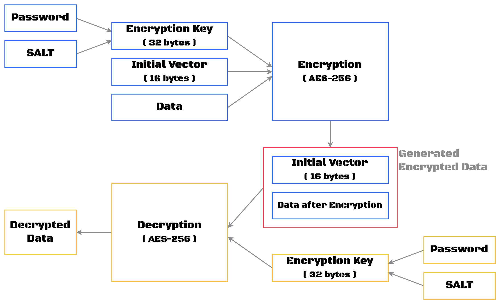

# [WASM-Cipher](https://Rei-Ashine.github.io/wasm-cipher/www/dist/)

DATE: Jan. 20th, 2023


## Diagram



## Directory Structure
```
.
├── README.md
├── Cargo.toml
├── PNG
├── src
│   ├── lib.rs
│   └── cipher.rs
└── www
    ├── bootstrap.js
    ├── index.js
    ├── index.html
    ├── dist
    ├── public
    ├── package.json
    └── webpack.config.js
```
---
```
===============================================================================
 Language            Files        Lines         Code     Comments       Blanks
===============================================================================
 CSS                     1          156          114           17           25
 JavaScript              5          431          327           77           27
 JSON                    2         6547         6547            0            0
 Markdown                2           74            0           53           21
 Rust                    2           74           58            0           16
 TOML                    1           17           13            1            3
-------------------------------------------------------------------------------
 HTML                    2          144          116           10           18
 |- JavaScript           2           20           20            0            0
 (Total)                            164          136           10           18
===============================================================================
 Total                  15         7443         7175          158          110
===============================================================================
```

## Reference
- [『高効率言語 Rust 書きかた・作りかた』](https://www.socym.co.jp/book/1351)


